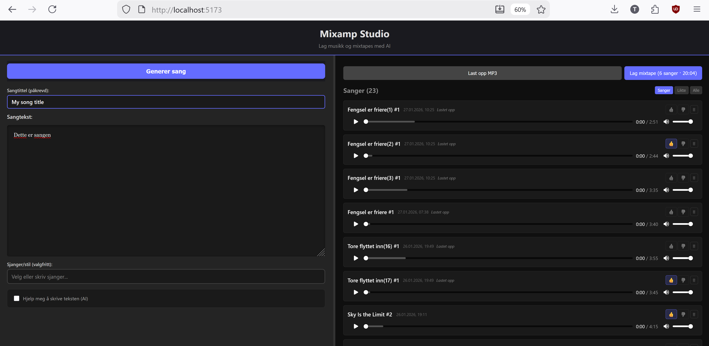
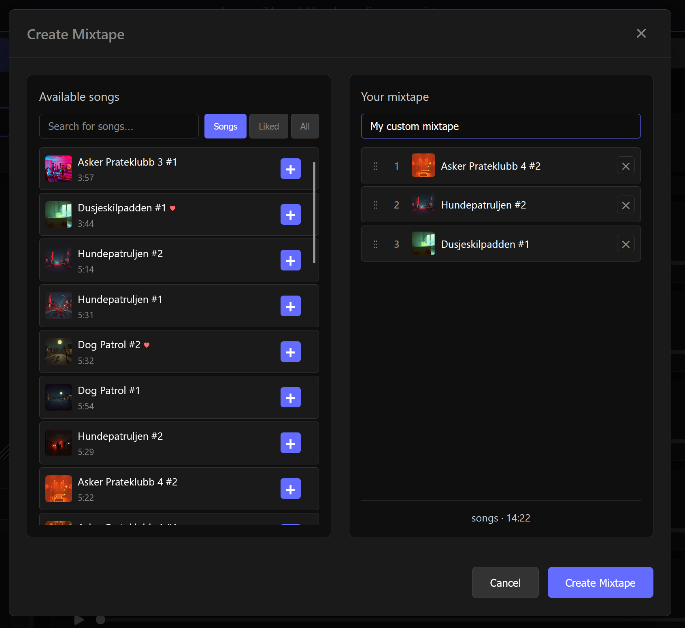

# 🎵 Mixtape Studio

## TL;DR

- Create offline-friendly mixtapes (one file with chapters)
- Select, order and curate your favorite tracks
- Export a single file built for long listening sessions
- Upload or generate music (optional)
- AI features are completely optional


**Mixtape Studio** is a web application for **collecting, organizing, and exporting music as finished mixtapes**.

The app is built for practical use:
- long listening sessions
- offline playback (flights, car, workouts)
- simple curation of favorite tracks

Support for AI-based text and music generation is available as an **optional add-on**, but is not required to use the app.



---

## What is a mixtape?

In Mixtape Studio, a mixtape is:
- one continuous audio file
- with clear chapter markers per track
- in a format that works well offline (M4B)

This makes it ideal for:
- travel without internet access
- long workout sessions
- driving
- focused work

Instead of many individual files, you get **one structured file** — made to simply press play and let it run.

---

## Features

### 🎶 Mixtapes (core functionality)

- 🎼 Create finished mixtapes (M4B) with chapters
- 📤 Upload your own MP3 files
- 🎧 Play tracks directly in the app
- 👍 Mark favorites
- 🔍 Filter tracks (All / Liked / Standard)
- ⚙️ Advanced mixtape mode:
  - choose track order
  - include / exclude tracks
  - name the mixtape before generation

Mixtapes can be generated with a single click, or fine-tuned in detail using advanced mode.



---

### ✍️ Text and music (optional)

Mixtape Studio can also be used to **create new content**, but this is entirely optional and not required for the core functionality.

- Write song lyrics manually
- Use AI to generate lyrics (optional)
- Generate music from text (optional)
- Edit lyrics before music generation

> ℹ️ These features require external API keys and may incur costs.

---

## Subscriptions (AI features only)

The app works fully **without any subscriptions**.

The following services are only required if you want to use AI features:

- **OpenAI API** – text generation  
  https://platform.openai.com

- **Suno API** – music generation  
  https://sunoapi.org

If API keys are missing, relevant AI actions are automatically disabled in the UI without error messages.

---

## Architecture

### Frontend
- React 19
- TypeScript
- Vite
- Resizable two-panel layout
- WebSocket for real-time updates

### Backend
- Node.js
- Express
- SQLite (local storage)
- WebSocket
- Optional integration with OpenAI and Suno

---

## Quick start

### Requirements
- Node.js v18 or newer
- npm

### Installation
```bash
npm install


### Environment variables (optional)

- Create a `.env` fil i `backend/` mappen:
```bash
cp backend/.env-template backend/.env
```

- Only add API keys if you want to use AI features:
```
OPENAI_API_KEY=din_openai_nøkkel_her
SUNO_API_KEY=din_suno_nøkkel_her
PORT=3001
CORS_ORIGIN=http://localhost:5173
```

### Running the app

Start both backend and frontend from the project root:
```bash
npm run dev
```

Open your browser at http://localhost:5173

#### Alternatively: run separately

Backend:
```bash
npm run dev -w backend
```

Frontend (in a new terminal):
```bash
npm run dev -w frontend
```

## Usage

### Create a song
- **Write lyrics:** Enter lyrics directly, or enable **Use AI to generate lyrics**
- **Edit lyrics:** Adjust the text as needed
- **Set title:** Enter a title (required) and optional genre
- **Generate song:** Click **Generate song** to create music from the text
- **View status:** Suno generation status is shown with a spinner and updated in real time via WebSocket

### Manage tracks
- **Play:** Finished tracks can be played directly from the history list
- **Feedback:** Use thumbs up/down on history items
- **Filter:** Filter tracks by Standard, Liked, or All
- **Upload MP3:** Upload your own songs (max 10 files, 10 MB per file)
- **Create mixtape:** Download all selected tracks as a single M4B file with chapters

## Project structure

```
mixtape-studio/
├── package.json            # Root scripts (dev, build) med npm workspaces
├── frontend/
│   ├── src/
│   │   ├── components/     # React components
│   │   ├── services/       # API og storage services
│   │   ├── hooks/          # Custom React hooks
│   │   ├── types/          # TypeScript types
│   │   └── App.tsx         # Main component
│   └── package.json
├── backend/
│   ├── src/
│   │   ├── routes/         # API routes
│   │   ├── services/       # OpenAI, Suno and DB services
│   │   └── server.ts       # Express server
│   ├── data/               # SQLite database
│   └── package.json
├── shared/
│   └── types/
│       └── index.ts        # Shared TypeScript typer
└── README.md
```

## API endpoints

### Backend
- `POST /api/chatgpt/generate-lyrics` – Generate lyrics from a prompt
- `POST /api/suno/generate` – Generate music from lyrics
- `GET /api/suno/status/:jobId` – Get music generation status
- `GET /api/history` – Fetch all history items
- `POST /api/history` – Create history item
- `PATCH /api/history/:id` – Update history item
- `DELETE /api/history/:id` – Delete history item
- `GET /api/genres` – Fetch genre history
- `POST /api/genres` – Save a new genre
- `DELETE /api/genres/:genre` – Delete a genre
- `GET /health` – Health check

### WebSocket
- Real-time updates for Suno job status

## Notes
- History is stored in a local SQLite database
- Maximum of 10,000 history items
- Maximum of 50 genres in genre history
- Suno generates two song variations per request
- Failed generations are automatically removed from history
- API keys must be configured in the backend `.env` file
- Resizable two-panel layout (30–70% width, persisted between sessions)
- Mixtapes are exported as M4B (AAC, 192 kbps) with embedded chapters

## License

ISC
